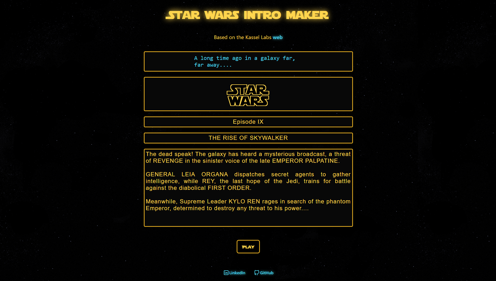

<h1 align="center">Star Wars Intro Maker</h1>

<div align="center">
   por  <a href="https://github.com/AitorMelero" target="_blank">Aitor Melero</a>.
</div>
</br>
<div align="center">

[](https://es.react.dev/)
[](https://www.typescriptlang.org/)
[](https://vitejs.dev/)
[](https://reactrouter.com/en/main)

---

</div>

> Nota: La implementación de esta web se ha basado en [la web de Kassel Labs](https://starwarsintrocreator.kassellabs.io/).

<!-- INDICE -->

## Índice

-   [Objetivo](#objetivo)
-   [Tecnologías](#tecnologías)
-   [Instalación y ejecución](#instalación-y-ejecución)
-   [Uso](#uso)
-   [Contacto](#contacto)

<!-- OBJETIVO -->

## Objetivo

El objetivo de este proyecto es crear una web donde un usuario pueda crear su propia intro de Star Wars rellenando un formulario.

Con respecto a la web, la motivación principal es ganar experiencia con diferentes tecnologías como [React](https://es.react.dev/), [TypeScript](https://www.typescriptlang.org/) o [React Router](https://reactrouter.com/en/main).

## Tecnologías

[](https://developer.mozilla.org/es/docs/Web/HTML)
[](https://developer.mozilla.org/es/docs/Web/CSS)
[](https://www.typescriptlang.org/)
[](https://developer.mozilla.org/es/docs/Web/JavaScript)
[](https://es.react.dev/)
[](https://reactrouter.com/en/main)
[](https://vitejs.dev/)

<!-- INSTALACION Y EJECUCION -->

## Instalación y ejecución

### Instalar dependencias:

```bash
npm install
```

### Ejecutar la web en modo desarrollador:

```bash
npm run dev
```

### Ejecutar la web en modo desarrollador en una red local:

```bash
npm run dev -- --host
or
npm run host
```

### Creación de ejecutable

```bash
npm run build
```

## Uso

Para crear una introducción propia basada en las introducciones de las películas de Star Wars, simplemente se debe rellenar un formulario con los textos que se quiere que aparezcan en la intro. Una vez pulsado el botón de _play_ se reproducirá automáticamente nuestra intro.

El aspecto del formulario es el siguiente:



## Contacto

### Aitor

[](https://github.com/AitorMelero)
[](https://www.linkedin.com/in/aitor-melero-pic%C3%B3n-678105293/)

